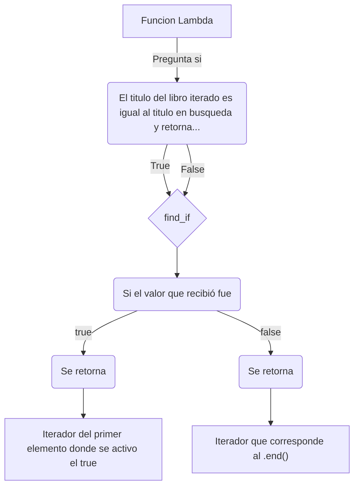

# Laboratorio 5

## Indice
1. [Resumen](#resumen)
2. [Instrucciones de ejecucion](#instrucciones-de-ejecucion)
3. [Teoria Evaluada](#teoria-evaluada)
   - [Funciones Lambda](#funciones-lambda)
   - [Predicados](#predicados)
   - [STL Algorithm: find_if](#stl-algorithm-find_if)


## Resumen
El presente laboratorio tenia el objetivo tomar el archivo _Laboratorio5.cpp_, ejecutarlo, entenderlo, agregar comentarios amplios del contenido del mismo, luego dividirlo en varios archivos de manera modular, y agregar más elementos al main de la función. En dicho archivo se tiene un ejemplo del uso de algoritmos de la STL como:
- `sort()`
- `find_if()`

ademas del uso de contenedores e iteradores donde se utilizan explicitamente los __vectores__. Asi, para ello se separa el codigo en 5 archivos distintos (main.cpp, Libro.cpp, LIbro.hpp, Biblioteca.cpp y Biblioteca.hpp) y se procede a agregar los comentarios en dichos archivos. Adicionalmente, en el presente instructivo se agregan las instruccionesd de compilacion y ejecucion; al igual que un breve resumen teorico donde se agregan conceptos que se investigaron para el entendimiento y profundizacion del codigo mismo.

<br>

## Instrucciones de ejecucion
Asi, asumiendo que para la evaluacion del presente laboratorio se busca revisar unicamente los archivos modulados, entonces los comandos de ejecucion para ello se presentan a continuacion, sin embargo, considere que __se asume que se encuentra posicionado en el directorio__ _.../ie0217/Laboratorios/Laboratorio5_ :

```
g++ -o tryout.exe main.cpp Libro.cpp Biblioteca.cpp
```
```
./tryout.exe
```
<br>

## Teoria Evaluada

### Funciones Lambda
Las funciones lambda son funciones anonimas que son creadas en tiempo de ejecucion, no en tiempo de compilacion y que fueron agregadas a partir del estandar de C++ 11. Para ello exploremos su sintaxis:
- [] dentro de ellos vienen los parametros de captura.
- () dentro de ellos vienen los parametros normales como cualquier funcion.
- {} dentro de ellos viene el cuerpo de la funcion.
- -> marca el tipo de variable que retorna la funcion.

Considere el siguiente ejemplo:

```cpp
#include <iostream>

class Foo {
    public:
        int m_attr;

        // Usar el this en el parametro de captura me permite capturar
        // todos los atributos de la clase sin tener que especificarlos
        void foo() {
            auto f=[this](){
                m_attr;
            };
        }
};

int main() {
    int b = 10;
    int c = 100;

    auto f = [&](int& a) -> int {
        b += 1;
        c += 1;
        return a+b+c;
    };

    int a = 10;
    std::cout << f(a) << std::endl; // Imprime 122
    std::cout << b << std::endl;    // Imprime 11
    std::cout << c << std::endl;    // Imprime 101

    return 0;
}
```

Lo que diferencia una _funcion lambda_ de una funcion normal son los __parametros de captura []__. Estos son muy utiles pues pueden capturar todo su entorno, todo el scope en el en el que han sido declaradas, y tomarlas para su cuerpo, por tanto busca las variables que esten dentro de [] en el scope que fue declarada la funcion para utilizarlas dentro de la funcion lambda libremente. Para ello considere las distintas formas que puede capturar variables:

```cpp
[a, b]     // captura por valor
[&a, &b]   // captura por referencia
[&]        // captura todo el scope por referencia
[=]        // captura todo el scope por copia o por valor
```

Tambien se comenta que si queremos devolver una funcion que tenga acceso a las cosas de una clase entonces en el cuerpo de captura le podemos especificar ``` this ``` con lo cual inmediatamente en la funcion lambda que estamos declarando, si teniamos un atributo publico entonces podemos acceder directamente a ellos sin tener que pasarlos por parametros.

_Obtenido de [Qué son las funciones lambdas en C++](http://ejehttps://openwebinars.net/blog/que-son-las-funciones-lambdas-en-cpp/mplo.com) y tambien puede consultar en [Expresiones lambda en C++](https://learn.microsoft.com/es-es/cpp/cpp/lambda-expressions-in-cpp?view=msvc-170)._

<br>
<br>


### Predicados
Los predicados son un un tipo especial de función auxiliar para algoritmos. Los predicados son funciones que devuelven un valor booleano. A menudo se utilizan para especificar un criterio de ordenación o búsqueda. Dependiendo de su propósito, los predicados son unarios o binarios. Es importante destacar que no todas las funciones unarias o binarias que devuelven un valor booleano son predicados válidos. La STL requiere que los predicados siempre produzcan el mismo resultado para el mismo valor. Esto excluye las funciones que modifican su estado interno cuando son llamadas.

En resumen, en C++, un predicado es una función u objeto de función (también conocido como functor) que toma uno o más argumentos y devuelve un valor booleano basado en alguna condición. Comúnmente se usa como parámetro en algoritmos y funciones que requieren una forma de comparar o evaluar elementos.

Los predicados se utilizan frecuentemente en algoritmos, especialmente en la biblioteca estándar de C++. Un algoritmo puede utilizar un predicado para realizar una serie de operaciones en una colección. En este caso, el predicado se refiere a una condición probada en cada elemento.

Hay muchas funciones de la STL en C++ que pueden tomar una función predicado como parámetro. Algunas de esas incluyen:
- `std::find_if `
- `std::remove_if`
- `std::count_if`
- `std::partition`
- `std::sort`
- y mas...

Asimismo, una de las carcateristicas mas importantes es que no solo podemos pasar funciones predefinidas, sino que tambien podemos __pasar funciones lambda__.

_Obtenido de [Passing Binary Predicate Parameter with Lambda in C++](https://cengizhanvarli.medium.com/passing-binary-predicate-parameter-with-lambda-in-c-649b790cd4d1#:~:text=In%20C%2B%2B%2C%20a%20predicate,to%20compare%20or%20evaluate%20elements.)._


#### Unary Predicates
Los predicados unarios verifican una propiedad específica de un único argumento. Un ejemplo típico es una función que se utiliza como criterio de búsqueda para encontrar el primer número primo:

<details>
<summary> Ejemplo de Unary Predicates </summary>

```cpp
#include <iostream>
#include <list>
#include <algorithm>
#include <cstdlib>       //for abs()
using namespace std;

//predicate, which returns whether an integer is a prime number
bool isPrime (int number)
{
    //ignore negative sign
    number = abs(number);
    // 0 and 1 are prime numbers
    if (number == 0 || number == 1) {
        return true;
    }
    //find divisor that divides without a remainder
    int divisor;
    for (divisor = number/2; number%divisor != 0; --divisor) {
        ;
    }
    //if no divisor greater than 1 is found, it is a prime number
    return divisor == 1;
}

int main()
{
    list<int> coll;
    //insert elements from 24 to 30
    for (int i=24; i<=30; ++i) {
        coll.push_back(i);
    }
    //search for prime number
    list<int>::iterator pos; 
    pos = find_if (coll.begin(), coll.end(),    //range
                   is Prime);                   //predicate
    if (pos != coll.end()) {
        //found
        cout << *pos << " is first prime number found" << endl;
    }
    else {
        //not found
        cout << "no prime number found" << endl;
    }
}

```

</details> <br>

En este ejemplo, el algoritmo `find_if()` se utiliza para buscar el primer elemento del rango dado para el cual el predicado unario pasado devuelve verdadero. Aquí, el predicado es la función `isPrime()`. Esta función verifica si un número es un número primo. Al usarla, el algoritmo devuelve el primer número primo en el rango dado. Si el algoritmo no encuentra ningún elemento que coincida con el predicado, devuelve el final del rango (su segundo argumento). Esto se verifica después de la llamada. La colección en este ejemplo tiene un número primo entre 24 y 30. Por lo tanto, la salida del programa es la siguiente:

<details>
<summary> Resultado </summary>

> 29 is first prime number found

</details> <br>

_Obtenido de [unary predicate c++](http://www.ccplusplus.com/2014/01/unary-predicate-c.html)._


<br>
<br>


### STL Algorithm: find_if

Esta función devuelve un iterador al primer elemento en el rango [first, last) para el cual el predicatdo devuelve `true`. Si no se encuentra ningún elemento así, la función devuelve _last_.

#### Sintaxis
```
InputIterator find_if (InputIterator first, InputIterator last, Predicate pred);
```

#### Parametros
- `first, last` : rango que contiene todos los elementos entre el primero y el último, incluido el elemento señalado por _first_ pero excluyendo elemento señalado por _last_.
- `pred` : predicado que puede ser tando una funcion unaria o una funcion lambda como se analiza en la seccion anterior.

#### Valor de Retorno
- Esta función devuelve un iterador al primer elemento en el rango [__first, last__) para el cual `pred` (función) devuelve verdadero. Si no se encuentra ningún elemento, es decir, el predicado siempre resulta en _false_ en la verificacion de cada elemento, entonces la función devuelve el iterador a __last__.

#### Ejemplo del Programa Implementado en el Laboratorio
ESta funcion se utiliza en el archivo _"Biblioteca.cpp"_, a continuacion se detalla explicitamente su implementacion:

```cpp
std::vector<Libro>::iterator Biblioteca::buscarLibroPorTitulo(const std::string& titulo) {
    return std::find_if(libros.begin(), libros.end(), [&titulo](const Libro& l) {
        return l.titulo == titulo; // comparacion booleana
    });
}
```

donde lo anterior entonces puede leerse como:

1. `buscarLibroPorTitulo()` es una funcion de la clase Biblioteca que retorna un iterador de un vector que contiene objetos de la clase Libro.
2. La funcion recibe un argumento constante y por referencia tipo string que contiene el titulo del libro que queremos buscar.
3. En el cuerpo de la funcion haremos el retorno dl resultado tras usar el algoritmo `find_if`.
    - Este algoritmo entonces trabaja en el rango desde el inicio hasta el final del vector libros.
    - Determina su `true` y `false` mediante una funcion lambda que captura el titulo pasado como argumento por referencia y recibe por parametro normal la referencia constate del libro que se esta iterando.
    - Luego la funcion lambda se encarga de hacer la comparativa logica mediante un _return_ que pregunta que si el titulo del libro que se esta iterando es igual al titulo que pasamos por parametro.
4. Entonces, en resumen:

